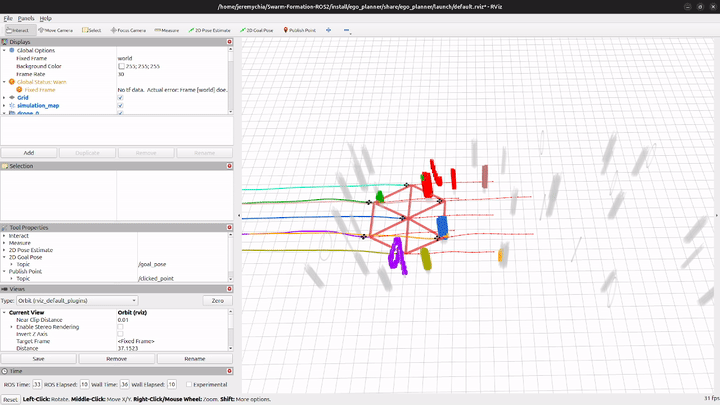
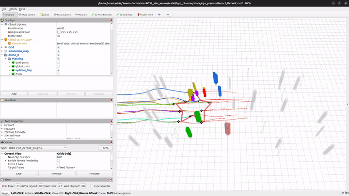
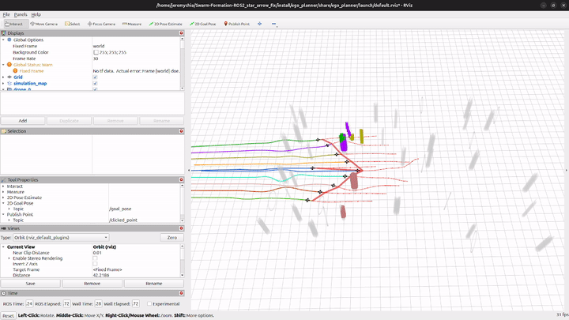

# Swarm-Formation-ROS2

**ROS 2 Jazzy port** of [ZJU-FAST-Lab/Swarm-Formation](https://github.com/ZJU-FAST-Lab/Swarm-Formation) with additional formation shapes (star, arrow).

A distributed swarm trajectory optimization framework for formation flight in dense obstacle environments. Drones fly in formation while autonomously avoiding obstacles — each drone plans independently with no central controller.

<p align="center">
  
</p>
<p align="center"><em>Hexagon Formation (7 drones)</em></p>

<p align="center">
  
</p>
<p align="center"><em>Star Formation (10 drones)</em></p>

<p align="center">
  
</p>
<p align="center"><em>Arrow Formation (10 drones)</em></p>

## Credits

This project is a **ROS 2 port and extension** of the original work by:

> **Lun Quan\*, Longji Yin\*, Chao Xu, and Fei Gao**
> [Fast-Lab](http://zju-fast.com/), Zhejiang University
>
> Paper: [Distributed Swarm Trajectory Optimization for Formation Flight in Dense Environments](https://arxiv.org/abs/2109.07682) (ICRA 2022)

```bibtex
@article{quan2021distributed,
  title={Distributed Swarm Trajectory Optimization for Formation Flight in Dense Environments},
  author={Lun Quan and Longji Yin and Chao Xu and Fei Gao},
  journal={arXiv preprint arXiv:2109.07682},
  year={2021}
}
```

### What's new in this fork

- Ported all 22 packages from **ROS 1 Noetic** to **ROS 2 Jazzy**
- Added **star formation** (10 drones — 5 outer tips + 5 inner valleys)
- Added **arrow formation** (10 drones — V-shaped with tip, wings, and tail)
- 10+ bug fixes to support formations beyond the original 7-drone hexagon
- Conda-based setup for reproducible builds (no system ROS install needed)

## Available Formations

| Formation | Drones | Description |
|-----------|--------|-------------|
| Hexagon | 7 | 1 center + 6 outer vertices (original) |
| Star | 10 | 5 outer tips + 5 inner valleys |
| Arrow | 10 | 1 tip + 4+4 wings + 1 tail |

## Prerequisites

- **OS:** Ubuntu 22.04 or 24.04
- **Conda:** [Miniconda](https://docs.conda.io/en/latest/miniconda.html) or Anaconda
- **GPU:** Not required (CPU-only simulation)
- **RAM:** 8 GB minimum, 16 GB recommended for 10-drone formations

## Setup

### 1. Clone the repository

```bash
cd ~
git clone https://github.com/<your-username>/Swarm-Formation-ROS2.git
cd Swarm-Formation-ROS2
```

### 2. Create the Conda environment

The setup script installs ROS 2 Jazzy and all dependencies via Conda (no system ROS install needed):

```bash
./setup_conda_env.sh
```

This creates a Conda environment called `swarm_ros2` with:
- ROS 2 Jazzy (rclcpp, rviz2, tf2, pcl, etc.)
- Build tools (colcon, cmake, compilers)
- Libraries (Eigen3, PCL, OpenCV, Boost)

### 3. Build the workspace

```bash
# Activate the environment (run this in every new terminal)
source activate.sh

# Build all packages
colcon build --symlink-install --cmake-args -DCMAKE_BUILD_TYPE=Release

# Source the workspace overlay
source install/setup.bash
```

## Usage

> **Important:** Run `source activate.sh` in every new terminal before launching.

### Launch a formation

Each formation requires **two terminals**.

**Terminal 1 — Launch the simulation:**

```bash
source activate.sh

# Choose one:
ros2 launch ego_planner normal_hexagon_launch.py   # Hexagon (7 drones)
ros2 launch ego_planner star_launch.py              # Star (10 drones)
ros2 launch ego_planner arrow_launch.py             # Arrow (10 drones)
```

**Terminal 2 — Launch RViz2:**

```bash
source activate.sh
ros2 launch ego_planner rviz_launch.py
```

### Send the drones to their goal

Once all drones show `[FSM]: from INIT to WAIT_TARGET` in Terminal 1:

1. In **RViz2**, click the **2D Goal Pose** button in the top toolbar
2. Click and drag anywhere on the map to set a goal direction
3. All drones will begin flying in formation toward the goal

> **Use the RViz2 "2D Goal Pose" button** to issue commands to the drones. Do not use `send_goal.sh` — it delivers goals with a timing stagger between drones that breaks formation.

### What to expect

- Drones start in their formation positions on the left side of the map
- After receiving the goal, they fly through randomly generated obstacles
- The formation will deform slightly when squeezing through gaps — this is by design (the Laplacian metric allows scaling, rotation, and translation)
- The formation recovers after passing through obstacles
- Coloured trajectory lines and red formation edges are shown in RViz2

## Configuration

Formation parameters are in `src/planner/plan_manage/config/`:

| Parameter | Hexagon | Star | Arrow | Description |
|-----------|---------|------|-------|-------------|
| `max_vel` | 0.5 | 0.15 | 0.3 | Max drone speed (m/s) |
| `weight_formation` | 25,000 | 75,000 | 50,000 | Formation shape priority |
| `weight_obstacle` | 50,000 | 50,000 | 50,000 | Obstacle avoidance priority |
| `obstacle count` | 30 | 12 | 8 | Number of obstacles in map |

> **Tuning tip:** Ratios between weights matter more than absolute values. If formation breaks, reduce `max_vel` before increasing `weight_formation`.

## Project Structure

```
src/
├── planner/
│   ├── plan_manage/          # FSM planner node, launch files, configs
│   ├── traj_opt/             # Trajectory optimizer (LBFGS + Laplacian metric)
│   ├── swarm_graph/          # Formation topology and Laplacian computation
│   ├── swarm_bridge/         # Multi-drone trajectory sharing
│   ├── plan_env/             # Environment representation (ESDF)
│   ├── path_searching/       # A* path search for initial paths
│   └── traj_utils/           # Trajectory utilities and visualization
├── uav_simulator/
│   ├── so3_quadrotor_simulator/  # Quadrotor dynamics simulation
│   ├── so3_control/              # SO3 attitude controller
│   ├── map_generator/            # Random obstacle map generation
│   ├── local_sensing/            # Simulated depth sensing
│   └── fake_drone/               # Drone mesh visualization
└── Utils/
    ├── quadrotor_msgs/       # Custom message types
    ├── uav_utils/            # UAV utility functions
    ├── pose_utils/           # Pose conversion utilities
    ├── odom_visualization/   # Odometry visualization
    └── rviz_plugins/         # Custom RViz2 plugins
```

## Troubleshooting

| Issue | Solution |
|-------|----------|
| Drones don't move after goal | Wait for ALL drones to print `WAIT_TARGET` before sending goal |
| Formation breaks apart | Use RViz2 "2D Goal Pose" button, not `send_goal.sh` |
| Build fails with missing package | Run `source activate.sh` to load Conda environment |
| `TF frame warning: [world]` | Cosmetic warning, safe to ignore |
| RViz2 shows no drones | Check that display groups are enabled in the left panel |
| Drones crash near obstacles | Reduce `max_vel` or reduce obstacle count in launch file |

## Acknowledgements

- **Original authors:** [Lun Quan](http://zju-fast.com/lun-quan/), [Longji Yin](http://zju-fast.com/longji-yin/), [Chao Xu](http://zju-fast.com/research-group/chao-xu/), [Fei Gao](http://zju-fast.com/research-group/fei-gao/) — [ZJU-FAST-Lab](http://zju-fast.com/)
- **Original repository:** [ZJU-FAST-Lab/Swarm-Formation](https://github.com/ZJU-FAST-Lab/Swarm-Formation) (ROS 1)
- **Paper:** [arXiv:2109.07682](https://arxiv.org/abs/2109.07682) (ICRA 2022)
- **ROS 2 port and new formations by:** Jeremy Chia

## License

This project inherits the license from the original [Swarm-Formation](https://github.com/ZJU-FAST-Lab/Swarm-Formation) repository. See [LICENSE](LICENSE) for details.
